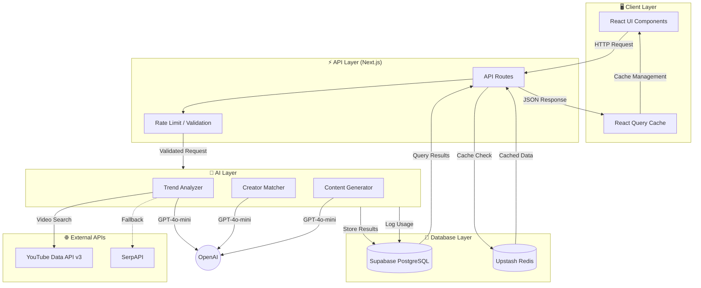
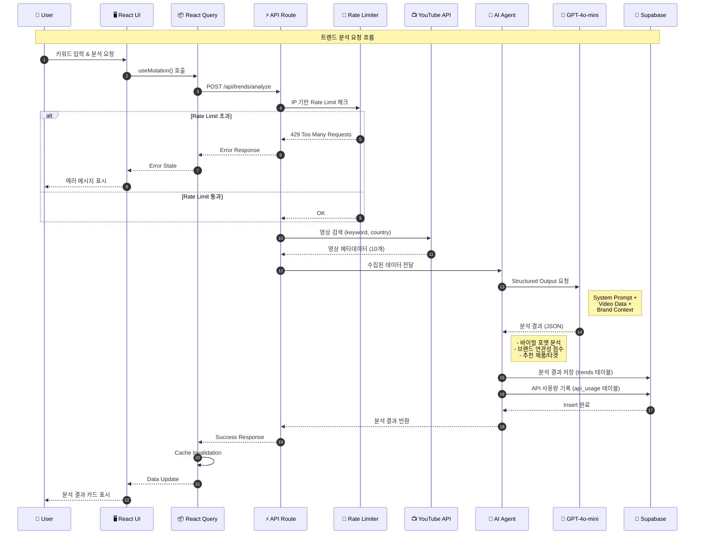

# 기술 아키텍처 문서

> 삼양 트렌드·크리에이터 인사이트 AI 에이전트 - 개발자 및 기술 기획자를 위한 아키텍처 가이드

---

## 목차

- [시스템 아키텍처](#시스템-아키텍처)
- [기술 흐름 (Technical Flow)](#기술-흐름-technical-flow)
- [핵심 모듈 구조](#핵심-모듈-구조)
- [데이터 플로우](#데이터-플로우)
- [AI/LLM 파이프라인](#aillm-파이프라인)
- [인증 및 권한 체계](#인증-및-권한-체계)
- [캐싱 전략](#캐싱-전략)
- [관련 문서](#관련-문서)

---

## 시스템 아키텍처

```
┌─────────────────────────────────────────────────────────────────────────┐
│                              Client Layer                                │
│  ┌─────────────┐  ┌─────────────┐  ┌─────────────┐  ┌─────────────┐    │
│  │  Dashboard  │  │   Trends    │  │  Creators   │  │   Reports   │    │
│  │   Widget    │  │    Page     │  │    Page     │  │    Page     │    │
│  └──────┬──────┘  └──────┬──────┘  └──────┬──────┘  └──────┬──────┘    │
│         │                │                │                │            │
│         └────────────────┼────────────────┼────────────────┘            │
│                          ▼                ▼                              │
│              ┌─────────────────────────────────────┐                    │
│              │     React Query (TanStack Query)    │                    │
│              │     - Cache Management              │                    │
│              │     - Query Invalidation            │                    │
│              └──────────────────┬──────────────────┘                    │
└─────────────────────────────────┼───────────────────────────────────────┘
                                  │
                                  ▼
┌─────────────────────────────────────────────────────────────────────────┐
│                           API Layer (Next.js)                           │
│  ┌────────────────────────────────────────────────────────────────┐    │
│  │                     API Routes (/api/*)                         │    │
│  │  ┌──────────┐  ┌──────────┐  ┌──────────┐  ┌──────────────┐   │    │
│  │  │ /trends  │  │/creators │  │ /content │  │   /reports   │   │    │
│  │  └────┬─────┘  └────┬─────┘  └────┬─────┘  └───────┬──────┘   │    │
│  │       │             │             │                │           │    │
│  └───────┼─────────────┼─────────────┼────────────────┼───────────┘    │
│          ▼             ▼             ▼                ▼                 │
│  ┌──────────────┐  ┌──────────────┐  ┌──────────────┐                  │
│  │  Rate Limit  │  │  Zod Schema  │  │    Logger    │                  │
│  │  (Upstash)   │  │  Validation  │  │              │                  │
│  └──────────────┘  └──────────────┘  └──────────────┘                  │
└─────────────────────────────────────────────────────────────────────────┘
                                  │
        ┌─────────────────────────┼─────────────────────────┐
        ▼                         ▼                         ▼
┌───────────────┐       ┌─────────────────┐       ┌─────────────────┐
│   AI Layer    │       │  Database Layer │       │  External APIs  │
│               │       │                 │       │                 │
│ ┌───────────┐ │       │   ┌─────────┐   │       │ ┌─────────────┐ │
│ │  OpenAI   │ │       │   │Supabase │   │       │ │ YouTube API │ │
│ │ GPT-4o-   │ │       │   │PostgreSQL│  │       │ │  Data v3    │ │
│ │   mini    │ │       │   └─────────┘   │       │ └─────────────┘ │
│ └───────────┘ │       │                 │       │                 │
│               │       │   ┌─────────┐   │       │ ┌─────────────┐ │
│ ┌───────────┐ │       │   │  Redis  │   │       │ │   SerpAPI   │ │
│ │  Vercel   │ │       │   │(Upstash)│   │       │ │  (backup)   │ │
│ │  AI SDK   │ │       │   └─────────┘   │       │ └─────────────┘ │
│ └───────────┘ │       │                 │       │                 │
└───────────────┘       └─────────────────┘       └─────────────────┘
```

### 데이터 흐름도 (Data Flow Diagram)



### 시퀀스 다이어그램 (User → System → LLM)



---

## 기술 흐름 (Technical Flow)

### 1. 트렌드 분석 플로우

```
[사용자 입력]
     │
     ▼
┌────────────────────────────────────────────────────────────┐
│ POST /api/trends/analyze                                   │
│ Input: { keyword, platform, country }                      │
└────────────────────────────────────────────────────────────┘
     │
     ├──────────────────────────────────┐
     ▼                                  ▼
┌─────────────────┐            ┌─────────────────┐
│  Rate Limiter   │            │  Zod Validation │
│  (IP-based)     │            │  Schema Check   │
└────────┬────────┘            └────────┬────────┘
         │                              │
         └──────────────┬───────────────┘
                        ▼
┌────────────────────────────────────────────────────────────┐
│ Trend Collector (src/lib/api/trend-collector.ts)          │
│ - YouTube Data API v3 호출                                 │
│ - 영상 메타데이터 수집 (제목, 조회수, 채널명 등)              │
│ - Quota 사용량 추적                                        │
└────────────────────────────────────────────────────────────┘
                        │
                        ▼
┌────────────────────────────────────────────────────────────┐
│ AI Trend Analyzer (src/lib/ai/agents/trend-analyzer.ts)   │
│ - OpenAI GPT-4o-mini 호출                                  │
│ - 바이럴 포맷 분석 (POV, Challenge, Reaction 등)            │
│ - 삼양 브랜드 연관성 점수 산출 (0-100)                       │
│ - 추천 제품, 타겟 오디언스, 리스크 분석                      │
└────────────────────────────────────────────────────────────┘
                        │
                        ▼
┌────────────────────────────────────────────────────────────┐
│ Database Insert (src/lib/db/queries/trends.ts)            │
│ - Supabase PostgreSQL에 분석 결과 저장                     │
│ - Admin Client 사용 (RLS 우회)                             │
└────────────────────────────────────────────────────────────┘
                        │
                        ▼
┌────────────────────────────────────────────────────────────┐
│ API Usage Tracking (src/lib/db/queries/api-usage.ts)      │
│ - YouTube Quota 사용량 기록                                │
│ - GPT 토큰 사용량 기록                                     │
└────────────────────────────────────────────────────────────┘
                        │
                        ▼
                 [응답 반환]
```

### 2. 크리에이터 매칭 플로우

```
[크리에이터 정보 입력]
     │
     ▼
┌────────────────────────────────────────────────────────────┐
│ POST /api/creators/match                                   │
│ Input: { username, platform, followerCount, ... }         │
└────────────────────────────────────────────────────────────┘
     │
     ▼
┌────────────────────────────────────────────────────────────┐
│ Creator Matcher Agent (src/lib/ai/agents/creator-matcher.ts)│
│                                                            │
│ 1. 정량적 분석:                                            │
│    - 팔로워 품질 점수                                      │
│    - 참여도 강도                                           │
│    - 도달 잠재력                                           │
│                                                            │
│ 2. 정성적 분석:                                            │
│    - 콘텐츠 정렬도                                         │
│    - 브랜드 안전성                                         │
│    - 진정성                                                │
│                                                            │
│ 3. 종합 브랜드 적합도 점수 (0-100)                          │
└────────────────────────────────────────────────────────────┘
     │
     ▼
[DB 저장 → 응답 반환]
```

### 3. 콘텐츠 아이디어 생성 플로우

```
[브랜드/톤앤매너 선택]
     │
     ├─── (선택적) 트렌드 컨텍스트 전달
     │    sessionStorage.getItem('trendContext')
     │
     ▼
┌────────────────────────────────────────────────────────────┐
│ POST /api/content/generate                                 │
│ Input: { brandCategory, tone, targetCountry, trendContext }│
└────────────────────────────────────────────────────────────┘
     │
     ▼
┌────────────────────────────────────────────────────────────┐
│ Content Generator (src/lib/ai/agents/content-generator.ts) │
│                                                            │
│ - 브랜드별 프롬프트 템플릿 적용                              │
│ - 트렌드 분석 결과 활용 (있는 경우)                          │
│   - 후킹 패턴, 비주얼 패턴, 음악 패턴 반영                   │
│ - 3개의 다양한 아이디어 동시 생성                           │
│                                                            │
│ Output per idea:                                           │
│ - title, hook_text, hook_visual                           │
│ - scene_structure (3-5컷)                                 │
│ - editing_format, music_style                             │
│ - props_needed, hashtags                                  │
│ - expected_performance                                    │
└────────────────────────────────────────────────────────────┘
     │
     ▼
[DB 저장 → 응답 반환]
```

---

## 핵심 모듈 구조

### 디렉토리 구조

```
src/
├── app/                          # Next.js App Router
│   ├── (auth)/                   # 인증 관련 페이지
│   │   └── login/
│   ├── (dashboard)/              # 대시보드 레이아웃 그룹
│   │   ├── dashboard/            # 메인 대시보드
│   │   ├── trends/               # 트렌드 분석
│   │   ├── creators/             # 크리에이터 매칭
│   │   ├── content/              # 콘텐츠 아이디어
│   │   └── reports/              # 리포트 관리
│   └── api/                      # API Routes
│       ├── trends/
│       │   ├── route.ts          # GET: 목록, DELETE: 삭제
│       │   ├── analyze/route.ts  # POST: 트렌드 분석
│       │   └── daily/route.ts    # GET: 데일리 트렌드
│       ├── creators/
│       │   ├── route.ts          # GET: 목록, DELETE: 삭제
│       │   ├── match/route.ts    # POST: 크리에이터 매칭
│       │   └── [id]/route.ts     # GET: 상세, PATCH: 수정
│       ├── content/
│       │   ├── route.ts          # GET: 목록, DELETE: 삭제
│       │   └── generate/route.ts # POST: 아이디어 생성
│       ├── reports/
│       │   ├── route.ts          # GET/POST/DELETE
│       │   └── export/route.ts   # POST: 내보내기 (JSON/PDF)
│       └── usage/route.ts        # GET: API 사용량 통계
│
├── lib/                          # 핵심 라이브러리
│   ├── ai/                       # AI/LLM 모듈
│   │   ├── providers/            # LLM Provider 설정
│   │   │   ├── index.ts          # Provider 선택 로직
│   │   │   └── openai.ts         # OpenAI 클라이언트
│   │   ├── agents/               # AI 에이전트
│   │   │   ├── trend-analyzer.ts
│   │   │   ├── creator-matcher.ts
│   │   │   └── content-generator.ts
│   │   ├── utils.ts              # 공통 유틸 (토큰 로깅 등)
│   │   └── token-counter.ts      # 토큰 비용 계산
│   │
│   ├── db/                       # 데이터베이스 모듈
│   │   ├── server.ts             # Supabase 클라이언트
│   │   │   - createServerSupabaseClient() # RLS 적용
│   │   │   - createAdminClient()          # RLS 우회
│   │   └── queries/              # 쿼리 함수
│   │       ├── trends.ts
│   │       ├── creators.ts
│   │       ├── content-ideas.ts
│   │       ├── reports.ts
│   │       └── api-usage.ts
│   │
│   ├── api/                      # 외부 API 클라이언트
│   │   ├── youtube.ts            # YouTube Data API v3
│   │   ├── serpapi.ts            # SerpAPI (백업)
│   │   └── trend-collector.ts    # 통합 트렌드 수집기
│   │
│   ├── auth/                     # 인증 모듈
│   │   └── server.ts             # getServerUser(), getServerSession()
│   │
│   ├── cache/                    # 캐싱 모듈
│   │   └── redis.ts              # Upstash Redis 클라이언트
│   │
│   └── rate-limit.ts             # Rate Limiting (IP 기반)
│
├── components/                   # React 컴포넌트
│   ├── ui/                       # shadcn/ui 기본 컴포넌트
│   ├── dashboard/                # 대시보드 위젯
│   │   ├── ApiUsageWidget.tsx    # API 사용량 표시
│   │   └── ...
│   ├── trends/                   # 트렌드 관련 컴포넌트
│   ├── creators/                 # 크리에이터 관련 컴포넌트
│   ├── content/                  # 콘텐츠 관련 컴포넌트
│   └── reports/                  # 리포트 관련 컴포넌트
│
├── hooks/                        # Custom React Hooks
│   ├── useTrends.ts              # 트렌드 데이터 훅
│   ├── useCreators.ts            # 크리에이터 데이터 훅
│   ├── useContentIdeas.ts        # 콘텐츠 아이디어 훅
│   ├── useReports.ts             # 리포트 데이터 훅
│   └── useApiUsage.ts            # API 사용량 훅
│
└── types/                        # TypeScript 타입 정의
    ├── trends.ts
    ├── creators.ts
    ├── content.ts
    ├── reports.ts
    └── api-usage.ts
```

### 주요 모듈 설명

| 모듈            | 경로                  | 역할                                |
| --------------- | --------------------- | ----------------------------------- |
| **AI Agents**   | `src/lib/ai/agents/`  | GPT-4o-mini를 사용한 분석/생성 로직 |
| **DB Queries**  | `src/lib/db/queries/` | Supabase CRUD 함수 (RLS 고려)       |
| **API Clients** | `src/lib/api/`        | YouTube API, SerpAPI 클라이언트     |
| **Hooks**       | `src/hooks/`          | React Query 기반 데이터 페칭        |
| **Components**  | `src/components/`     | UI 컴포넌트 (shadcn/ui 기반)        |

---

## 데이터 플로우

### Supabase 테이블 관계

```
┌─────────────────┐
│     users       │
│  (Supabase Auth)│
└────────┬────────┘
         │
         │ created_by (FK)
         │
    ┌────┴─────┬────────────┬────────────┐
    ▼          ▼            ▼            ▼
┌─────────┐ ┌─────────┐ ┌──────────┐ ┌─────────┐
│ trends  │ │creators │ │content_  │ │ reports │
│         │ │         │ │  ideas   │ │         │
└────┬────┘ └─────────┘ └────┬─────┘ └─────────┘
     │                       │
     │ trend_id (FK)         │
     └───────────────────────┘

┌─────────────────────────────────────────────┐
│                 api_usage                    │
│  - endpoint: 호출된 API 경로                  │
│  - tokens_used: GPT 토큰 또는 YouTube quota  │
│  - cost: 예상 비용                           │
│  - response_time_ms: 응답 시간               │
└─────────────────────────────────────────────┘
```

### React Query 캐시 관리

```typescript
// Query Key 구조
['trends', { keyword, platform, country, showAll, ... }]
['creators', { platform, minBrandFitScore, showAll, ... }]
['contentIdeas', { brand_category, tone, showAll, ... }]
['reports', { type, showAll, ... }]
['apiUsage', 'quota']  // API 사용량 통계

// 캐시 무효화 패턴
queryClient.invalidateQueries({ queryKey: ['trends'] })
// → 모든 trends 관련 캐시 무효화 (전체/내 작업 모두)
```

---

## AI/LLM 파이프라인

### Vercel AI SDK 사용

```typescript
// src/lib/ai/agents/trend-analyzer.ts
import { generateObject } from 'ai';
import { openai } from '@/lib/ai/providers';
import { trendAnalysisSchema } from './schemas';

export async function analyzeTrend(input: TrendAnalysisInput) {
  const result = await generateObject({
    model: openai('gpt-4o-mini'),
    schema: trendAnalysisSchema, // Zod 스키마
    system: TREND_ANALYSIS_SYSTEM_PROMPT,
    prompt: buildUserPrompt(input),
  });

  return result.object; // 타입 안전한 구조화된 응답
}
```

### 토큰 사용량 추적

```typescript
// src/lib/ai/utils.ts
async function logTokenUsage(log: AICallLog) {
  // 1. 콘솔 로깅 (개발 환경)
  // 2. DB 저장 (api_usage 테이블)
  await createAPIUsage({
    endpoint: `ai/${log.model}`,
    tokens_used: log.usage?.totalTokens,
    cost: calculateCost(log.usage, log.model),
    response_time_ms: log.duration,
    status_code: log.success ? 200 : 500,
  });
}
```

### 프롬프트 구조

```
prompts/
├── system/
│   ├── trend-analyzer.md      # 트렌드 분석 시스템 프롬프트
│   ├── creator-matcher.md     # 크리에이터 매칭 시스템 프롬프트
│   └── content-generator.md   # 콘텐츠 생성 시스템 프롬프트
└── examples/
    └── few-shot-examples.json # Few-shot 학습 예시
```

---

## 인증 및 권한 체계

### Supabase 클라이언트 선택 가이드

| 상황                 | 사용할 클라이언트              | 이유                     |
| -------------------- | ------------------------------ | ------------------------ |
| 사용자별 데이터 조회 | `createServerSupabaseClient()` | RLS 적용으로 자동 필터링 |
| 시스템 통계 조회     | `createAdminClient()`          | RLS 우회 필요            |
| 시스템 데이터 생성   | `createAdminClient()`          | 사용자 세션 없이 생성    |

```typescript
// 사용자 데이터 조회 (RLS 적용)
const supabase = await createServerSupabaseClient();
const { data } = await supabase.from('trends').select('*').eq('created_by', userId); // RLS가 자동으로 필터링

// 시스템 통계 조회 (RLS 우회)
const adminClient = createAdminClient();
const { data } = await adminClient.from('api_usage').select('*'); // 모든 데이터 접근 가능
```

### showAll 파라미터 동작

```typescript
// API Route에서의 처리
const showAll = searchParams.get('showAll') === 'true';

if (showAll) {
  // 전체 데이터 조회 (created_by 필터 없음)
  query = supabase.from('trends').select('*');
} else {
  // 본인 데이터만 조회
  query = supabase.from('trends').select('*').eq('created_by', userId);
}
```

---

## 캐싱 전략

### 1. React Query 클라이언트 캐시

```typescript
// staleTime: 데이터가 "신선"한 것으로 간주되는 시간
// API 사용량: 2분 (자주 변경됨)
// 트렌드/크리에이터: 5분 (상대적으로 안정적)

useQuery({
  queryKey: ['apiUsage', 'quota'],
  queryFn: fetchApiQuota,
  staleTime: 2 * 60 * 1000, // 2분
});
```

### 2. Redis 캐시 (Upstash)

```typescript
// 데일리 트렌드: 1시간 캐싱
const cacheKey = `daily-trends:${today}`;
const cached = await redis.get(cacheKey);

if (!cached) {
  const data = await fetchDailyTrends();
  await redis.set(cacheKey, JSON.stringify(data), { ex: 3600 });
}
```

### 3. API Rate Limiting

```typescript
// IP 기반 Rate Limiting
const rateLimitResult = await rateLimitByIP(ip, {
  max: 10,      // 최대 요청 수
  window: 300,  // 5분 (300초)
});

// 응답 헤더
headers: {
  'X-RateLimit-Limit': '10',
  'X-RateLimit-Remaining': '7',
  'X-RateLimit-Reset': '1234567890',
}
```

---

## 관련 문서

| 문서                                         | 설명                           |
| -------------------------------------------- | ------------------------------ |
| [PRD.md](PRD.md)                             | 프로젝트 요구사항 및 문제 정의 |
| [TechStack.md](TechStack.md)                 | 기술 스택 상세 및 비용 분석    |
| [API.md](API.md)                             | API 엔드포인트 상세 문서       |
| [Task.md](Task.md)                           | 개발 작업 계획 및 진행 상황    |
| [TroubleShooting.md](TroubleShooting.md)     | 문제 해결 가이드               |
| [DEPLOYMENT.md](DEPLOYMENT.md)               | 배포 가이드                    |
| [YOUTUBE_API_SETUP.md](YOUTUBE_API_SETUP.md) | YouTube API 설정 가이드        |
| [SERPAPI_SETUP.md](SERPAPI_SETUP.md)         | SerpAPI 설정 가이드            |

---

## 빠른 참조

### 환경 변수

```bash
# 필수
YOUTUBE_API_KEY=
NEXT_PUBLIC_SUPABASE_URL=
NEXT_PUBLIC_SUPABASE_ANON_KEY=
SUPABASE_SERVICE_ROLE_KEY=
SUPABASE_SERVICE_ROLE_KEY=
DEFAULT_AI_PROVIDER=
OPENAI_API_KEY=
UPSTASH_REDIS_REST_URL=
UPSTASH_REDIS_REST_TOKEN=
LOG_LEVEL=
NEXT_PUBLIC_SENTRY_ENABLED=
SENTRY_ENVIRONMENT=
```

### 자주 사용하는 명령어

```bash
# 개발 서버
pnpm dev

# 빌드
pnpm build

# 타입 체크
pnpm type-check

# 린트
pnpm lint
```

---

**마지막 업데이트**: 2025-12-15
